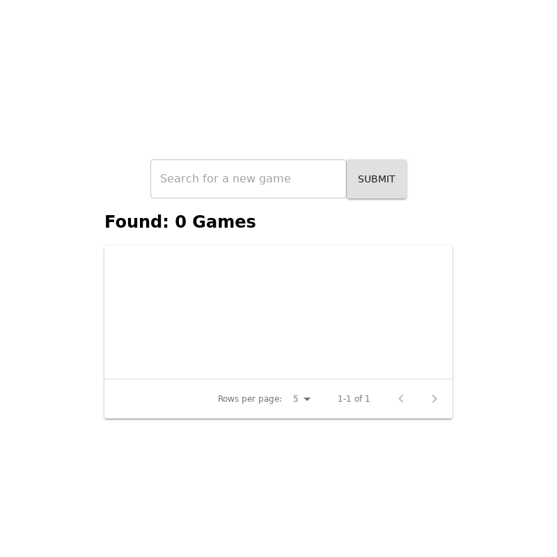

# `<AddGame />`

This compoent is where the user will go to inorder to add a brand new game to thier collection.
The user can search the game they want to add and then once the list is revealed they can then click the Add button to add that game to their collection

The Add button does not work in this current version.

## Example

> Image location: [`.loki/reference/chrome_AddGame_default.png`](../../../.loki/reference/chrome_AddGame_default.png)
>
> To regenerate:
>
> 1. `npm run test:playground` (skip if running)
> 1. `npm run test:visual:update -- --storiesFilter="^AddGame default\$"`
