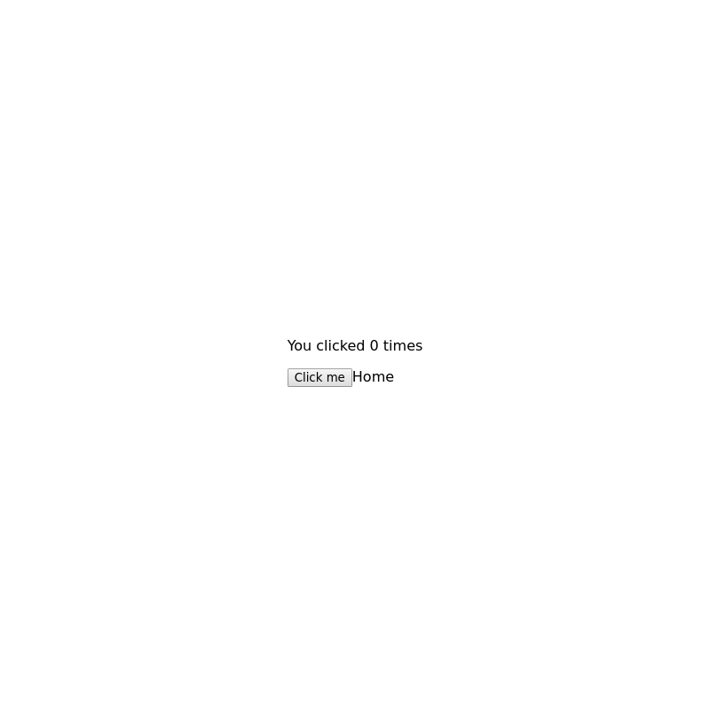

# `<Home />`

This page will display the users most recently added boardgames.

## Example

> Image location: [`.loki/reference/chrome_Home_default.png`](../../../.loki/reference/chrome_Home_default.png)
>
> To regenerate:
>
> 1. `npm run test:playground` (skip if running)
> 1. `npm run test:visual:update -- --storiesFilter="^Home default\$"`
