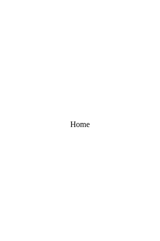

# `<Home />`

This is the base `Home` component provided by [Create React App](https://facebook.github.io/create-react-app/). We've wrapped it up in our prescribed component directory structure which includes:

- `index.css`: component styles
- `index.tsx`: component code
- `README.md`: component documentation (hey, that's me!)
- `screenshots`: visual regression screenshots taken by webdriverio
- `stories.tsx`: component playground (`npm run test:playground`)
- `test.tsx`: component tests (`npm run test:unit`)

## Example

> Image location: [`screenshots/reference/Home_320x480.png`](./screenshots/reference/Home_320x480.png)
> 
> To regenerate: 
> `npm run test:visual:update`