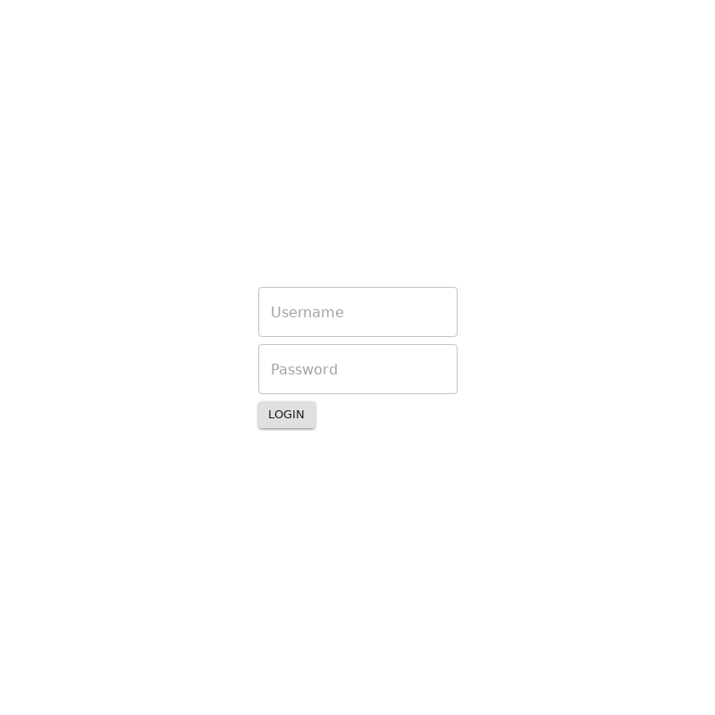

# `<Login />`
This component will display a login screen that will allow the user to type in thier username and password. 
They must have each block filled out in order to click the "Login" button

OVERVIEW_HERE

## Example

> Image location: [`.loki/reference/chrome_Login_default.png`](../../../.loki/reference/chrome_Login_default.png)
> 
> To regenerate: 
> 1. `npm run test:playground` (skip if running)
> 1. `npm run test:visual:update -- --storiesFilter="^Login default\$"`