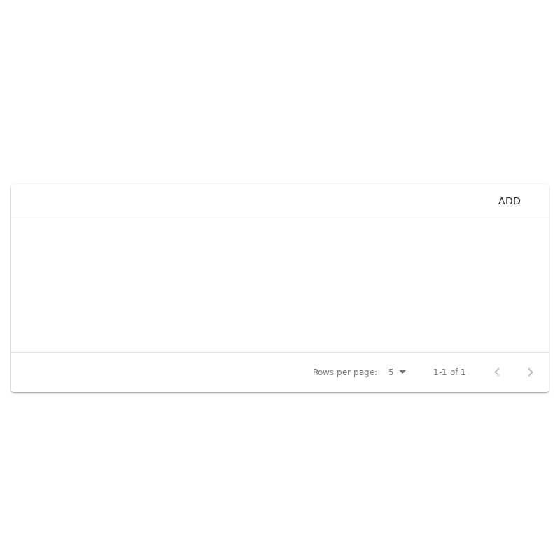

# `<ResultList />`

This component will display a list of boardgame items that has been passed down through its props.

## Example

> Image location: [`.loki/reference/chrome_ResultList_default.png`](../../../.loki/reference/chrome_ResultList_default.png)
>
> To regenerate:
>
> 1. `npm run test:playground` (skip if running)
> 1. `npm run test:visual:update -- --storiesFilter="^ResultList default\$"`
