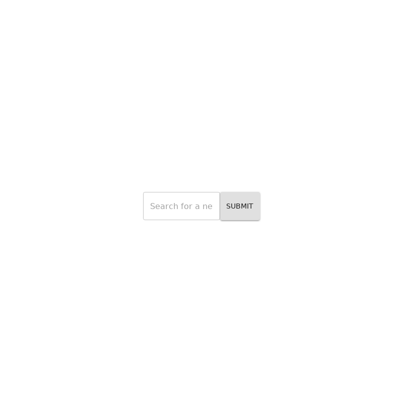

# `<SearchBar />`

OVERVIEW_HERE

## Example

> Image location: [`.loki/reference/chrome_SearchBar_default.png`](../../../.loki/reference/chrome_SearchBar_default.png)
> 
> To regenerate: 
> 1. `npm run test:playground` (skip if running)
> 1. `npm run test:visual:update -- --storiesFilter="^SearchBar default\$"`